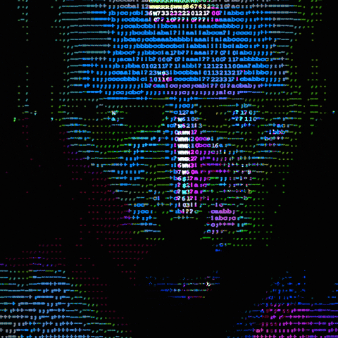

 

---

### 👤 System Status: About Me

<table>
  <tr>
    <td width="60%">
      <ul>
        <li>🧬 <b>Artificial Intelligence:</b> Currently developing <b>Kingsman</b>, an agentic AI financial governance system.</li>
        <li>🛡️ <b>Cybersecurity:</b> Deeply interested in networking, system hardening, and secure backend architecture.</li>
        <li>💻 <b>Backend Lead:</b> Experienced in building scalable systems with <b>Java, Spring Boot, and PostgreSQL</b>.</li>
        <li>🕶️ <b>Beyond the Code:</b> Trying to do better.</li>
      </ul>
    </td>
    <td width="40%" align="center">
      
       
     
    </td>
  </tr>
</table>

---

### 🧠 Core Processor (Languages & Tools)

  

---

### 📊 Network Activity & Stats

  
   
  

---

  $ echo "Building a better version of myself"

